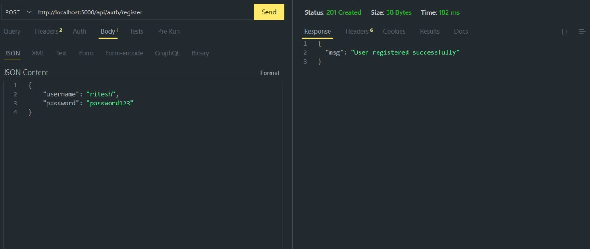
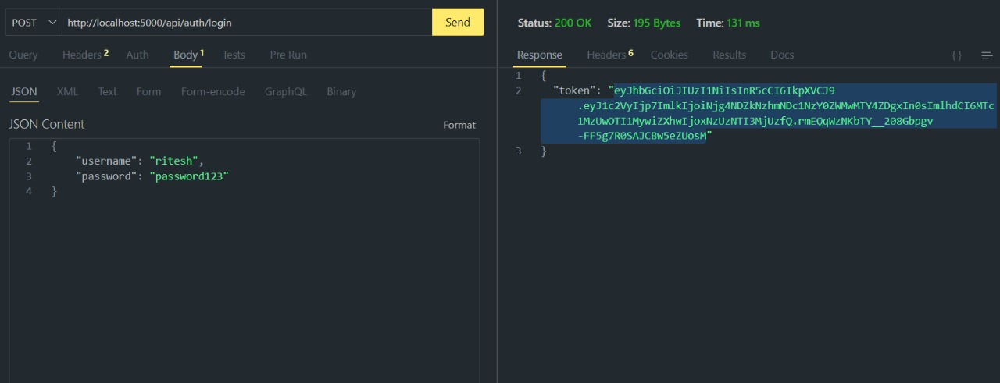
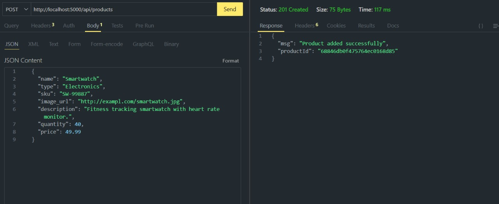
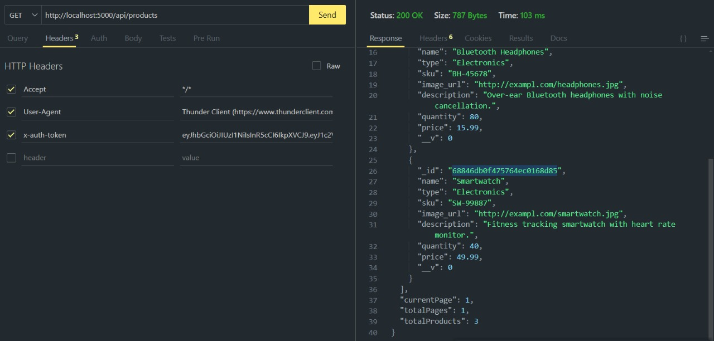
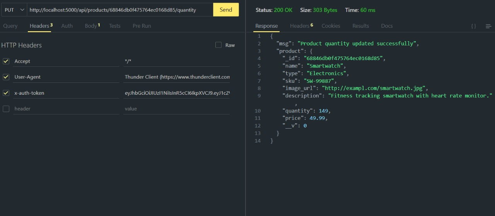

# FiMoney

A financial management application built with Node.js, Express, and MongoDB.

## Features

- User authentication with JWT tokens
- Secure password hashing with bcrypt
- RESTful API design
- MongoDB database integration
- Environment variable configuration

## Tech Stack

- **Backend**: Node.js, Express.js
- **Database**: MongoDB with Mongoose ODM
- **Authentication**: JSON Web Tokens (JWT)
- **Security**: bcryptjs for password hashing
- **Development**: Nodemon for auto-restart

## Prerequisites

Before running this application, make sure you have the following installed:

- [Node.js](https://nodejs.org/) (v14 or higher)
- [MongoDB](https://www.mongodb.com/) (local installation or MongoDB Atlas)
- npm or yarn package manager

## Installation

1. Clone the repository:
```bash
git clone <repository-url>
cd fimoney
```

2. Install dependencies:
```bash
npm install
```

3. Create a `.env` file in the root directory and add your environment variables:
```env
PORT=3000
MONGODB_URI=mongodb://localhost:27017/fimoney
JWT_SECRET=your_jwt_secret_key_here
JWT_EXPIRES_IN=7d
```

## Usage

### Development Mode

To run the application in development mode with auto-restart:

```bash
npm run dev
```

### Production Mode

To run the application in production:

```bash
node server.js
```

The server will start on the port specified in your `.env` file (default: 3000).

## Project Structure

```
fimoney/
├── server.js          # Main server file
├── routes/            # API route handlers
├── middleware/        # Custom middleware (authMiddleware)
├── models/            # MongoDB models
├── controllers/       # Route controllers
├── Screenshot/        # API endpoint screenshots
│   ├── register.jpg
│   ├── login.jpg
│   ├── postProduct.jpg
│   ├── getProduct.jpg
│   └── updateProductById.jpg
├── package.json       # Project dependencies and scripts
├── .env              # Environment variables (not in repo)
├── .gitignore        # Git ignore file
└── README.md         # Project documentation
```

## API Endpoints

### Authentication

#### POST /register - Register a new user
Register a new user account with email and password.

**Request Body:**
```json
{
  "username": "user@example.com",
  "password": "securepassword",
}
```


*Screenshot showing the register endpoint in action*

---

#### POST /login - User login
Authenticate user and receive JWT token.

**Request Body:**
```json
{
  "username": "user@example.com",
  "password": "securepassword"
}
```


*Screenshot showing the login endpoint in action*

---

### Products Management

#### POST / - Add new product (Protected)
Add a new product to the inventory. Requires authentication.

**Headers:**
```
Authorization: Bearer <jwt_token>
```

**Request Body:**
```json
{
  "name": "Product Name",
  "type": "Category Type",
  "sku": "UNIQUE-SKU-123",
  "image_url": "http://yourdomain.com/image.jpg",
  "description": "Detailed product description goes here.",
  "quantity": 0,
  "price": 0.00
}

```


*Screenshot showing the add product endpoint in action*

---

#### GET / - Get all products (Protected)
Retrieve all products from inventory. Requires authentication.

**Headers:**
```
Authorization: Bearer <jwt_token>
```


*Screenshot showing the get products endpoint in action*

---

#### PUT /:id/quantity - Update product quantity (Protected)
Update the quantity of a specific product. Requires authentication.

**Headers:**
```
Authorization: Bearer <jwt_token>
```

**Request Body:**
```json
{
  "quantity": 150
}
```


*Screenshot showing the update product quantity endpoint in action*

## Environment Variables

| Variable | Description | Required |
|----------|-------------|----------|
| `PORT` | Server port number | No (default: 3000) |
| `MONGODB_URI` | MongoDB connection string | Yes |
| `JWT_SECRET` | Secret key for JWT tokens | Yes |
| `JWT_EXPIRES_IN` | Token expiration time | No (default: 7d) |

## Screenshots

To help with API testing and documentation, this project includes screenshots of each endpoint in action. Screenshots are stored in the `Screenshot/` directory and show:

- Request/response examples using tools like Postman or Insomnia
- Proper header configuration for protected routes
- Sample request bodies and expected responses
- Authentication flow demonstration

### Adding Screenshots

1. Create a `Screenshot/` directory in your project root
2. Test each endpoint using an API client (Postman, Insomnia, etc.)
3. Take screenshots showing:
   - The endpoint URL and method
   - Request headers (especially Authorization for protected routes)
   - Request body (for POST/PUT requests)
   - Response data
4. Save screenshots with descriptive names as shown in the project structure

## Development

### Prerequisites for Development

- Install nodemon globally (optional): `npm install -g nodemon`

### Running Tests

```bash
npm test
```

### Code Style

This project follows standard JavaScript conventions. Consider using ESLint and Prettier for consistent code formatting.

## Contributing

1. Fork the repository
2. Create your feature branch (`git checkout -b feature/AmazingFeature`)
3. Commit your changes (`git commit -m 'Add some AmazingFeature'`)
4. Push to the branch (`git push origin feature/AmazingFeature`)
5. Open a Pull Request

## Security Considerations

- Passwords are hashed using bcryptjs
- JWT tokens are used for authentication
- Environment variables store sensitive data
- Input validation should be implemented
- Rate limiting should be considered for production

## License

This project is licensed under the ISC License.

## Support

If you encounter any issues or have questions, please create an issue in the repository.

---

**Note**: Remember to add your `.env` file to `.gitignore` to avoid committing sensitive information to version control.